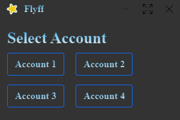
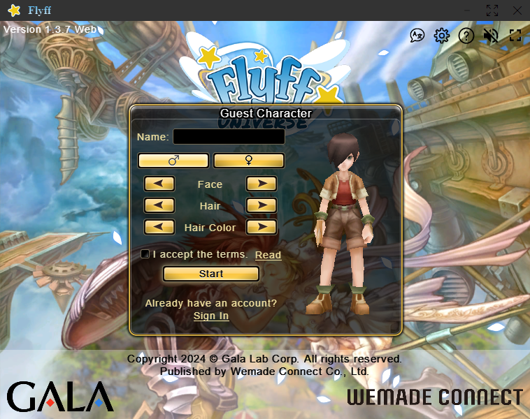
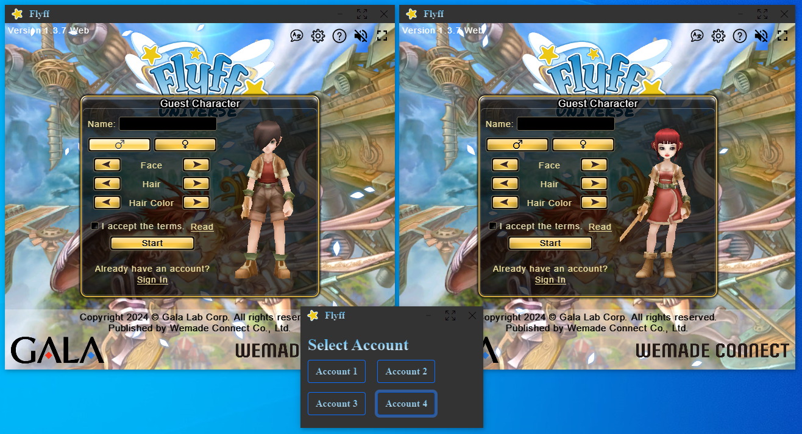

# Flyff Universe Launcher for Windows
This project provides a custom Windows .exe launcher with multi-account support for Flyff Universe, an MMORPG. It's built using Electron and features a custom title bar with system control buttons (minimize, maximize, close) on the right side and an app icon on the left side.

## Features
- **Multi-Account Support:** Launch multiple instances of Flyff Universe simultaneously.
- **Custom Title Bar:** Integrated system control buttons and an app-specific icon.
- **No Installation Required:** Simply download and run.

## Getting Started

### Installation
No installation is required. To start using the launcher:
1. Download the folder `flyff-multi-win32-x64`.
2. Run `flyff-multi.exe`.
3. Optional: Add as a non-Steam game for easy access from your Steam library.

### Configuration
#### Customizing Button Labels
To customize the labels on the select buttons:
1. Navigate to the `resources/app` folder inside `flyff-multi-win32-x64`.
2. Open the `select-session.html` file.
3. Locate the button text entries (e.g., "Account 1", "Account 2", etc.) and modify them as desired.

## Screenshots

